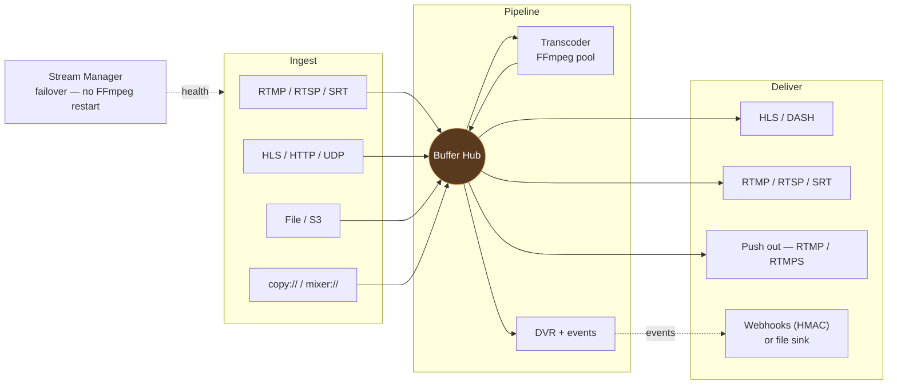

# Open Streamer

[](https://pkg.go.dev/github.com/ntt0601zcoder/open-streamer)
[](https://github.com/ntt0601zcoder/open-streamer/actions/workflows/ci.yml)
[](https://goreportcard.com/report/github.com/ntt0601zcoder/open-streamer)
[](https://codecov.io/gh/ntt0601zcoder/open-streamer)
[](LICENSE)

A high-availability live media server in Go. Ingests from any
common protocol, normalises through an internal MPEG-TS pipeline,
optionally transcodes with FFmpeg, and publishes over HLS, DASH, RTMP,
RTSP, and SRT — all from one binary, one process per host.



---

## Why Open Streamer

- **No process-per-stream.** One Go process handles N streams across N
  goroutines. FFmpeg is only spawned for transcoding — never for ingest.
- **Failover at the Go level.** When an input degrades, the Stream
  Manager swaps to the next-priority source in ~150ms without
  restarting FFmpeg. Buffer continuity → players see one
  `#EXT-X-DISCONTINUITY` and resume.
- **Hot-reload by diff.** `PUT /streams/{code}` restarts only what
  changed — adding a push destination doesn't disturb HLS viewers,
  toggling DASH doesn't drop RTMP push sessions.
- **Write never blocks.** The Buffer Hub fan-out is non-blocking —
  slow consumers drop packets, the writer is shielded. One stuck DVR
  cannot freeze every viewer.
- **Self-healing.** FFmpeg crashes restart with exponential backoff
  forever; the pipeline never tears down. Health detection flips
  status to `degraded` after sustained failure so ops sees it.

---

## Quick start

```bash
# 1. Install via the systemd installer (Linux)
sudo bash <(curl -sL https://raw.githubusercontent.com/ntt0601zcoder/open-streamer/main/build/reinstall.sh) v1.0.0

# 2. Or build from source
git clone https://github.com/ntt0601zcoder/open-streamer.git
cd open-streamer
make build && ./bin/open-streamer

# 3. Or Docker
make compose-up
```

Then create a stream:

```bash
curl -XPOST http://localhost:8080/api/v1/streams/news -d '{
  "inputs":   [{ "url": "https://upstream/playlist.m3u8", "priority": 0 }],
  "protocols": { "hls": true }
}'
```

Stream is live at `http://localhost:8080/news/index.m3u8`. Full setup
walkthrough in [USER_GUIDE.md](./docs/USER_GUIDE.md).

---

## Documentation

| Doc | Audience | What's in it |
|---|---|---|
| [USER_GUIDE.md](./docs/USER_GUIDE.md) | Operator | Install, create streams, hot-reload, hooks, troubleshooting |
| [CONFIG.md](./docs/CONFIG.md) | Operator | Every config field with examples + defaults reference |
| [ARCHITECTURE.md](./docs/ARCHITECTURE.md) | Contributor | Subsystem design, invariants, data flow |
| [APP_FLOW.md](./docs/APP_FLOW.md) | Contributor / Ops | Step-by-step traces (boot, failover, transcoder crash, hot-reload) + full events reference |
| [EVENTS.md](./docs/EVENTS.md) | Operator / Integrator | Catalogue of every domain event, payload shape, hook recipes |
| [METRICS.md](./docs/METRICS.md) | Operator / SRE | Prometheus metrics reference + dashboard / alert PromQL examples |
| [FEATURES_CHECKLIST.md](./docs/FEATURES_CHECKLIST.md) | Everyone | What's implemented today, what's planned, what's locked-out |

API spec auto-generated at `/swagger/` (run `make swagger` to
regenerate from annotations).

---

## Highlights

- **URL-driven ingest** — protocol + push/pull mode detected from
  scheme/host. Supports RTMP, RTSP, SRT, UDP/multicast, HLS, raw
  HTTP-TS, file (with loop), S3, plus `copy://` (in-process re-stream)
  and `mixer://` (combine video + audio from two streams).
- **Multi-input failover** — N inputs per stream, prioritised. Manager
  monitors health, switches transparently. Last 20 switches recorded
  with reason (`error` / `timeout` / `manual` / `failback` / `recovery`
  / `input_added` / `input_removed`).
- **ABR transcoding** — bounded FFmpeg pool with NVENC / VAAPI / QSV /
  VideoToolbox. Per-rung profiles (resolution, bitrate, codec, preset,
  GOP, B-frames, refs, SAR, resize mode). Pure-GPU pipeline (no
  hwdownload round-trip) for NVENC.
- **Multi-output mode** — single FFmpeg per stream emits N rendition
  pipes; ~50% NVDEC + ~40% RAM saved per ABR stream.
- **Cross-encoder preset translation** — `veryfast` (libx264) auto-maps
  to `p2` (NVENC) etc. so codec/preset family mismatches never crash
  encoders.
- **HLS + DASH ABR** — master playlist + per-track variants;
  `#EXT-X-DISCONTINUITY` per failover.
- **RTSP / RTMP / SRT play** — shared listeners (one port per
  protocol). Single-segment codes use the `live/` prefix:
  `rtmp://host/live/news`. Multi-segment codes are addressed at their
  raw path: `rtmp://host/region/north/news`. The server strips a
  leading `live/` when present, so either form reaches multi-segment
  streams.
- **Templates** — reusable bundle of stream config (transcoder,
  protocols, push, DVR, watermark, thumbnail, inputs, tags,
  stream-key). Reference one from a stream via the `template` field
  and the stream inherits every config-like field it leaves at the
  zero value. Updating the template hot-reloads every running stream
  that inherits from it.
- **Auto-publish** — a template can declare URL-path prefixes. When
  an encoder pushes to a path matching one of the prefixes and the
  template carries a `publish://` input, the server materialises a
  **runtime stream** on the fly. Runtime streams are RAM-only, appear
  in `GET /streams` with `source: "runtime"`, and disappear 30 s
  after the last packet.
- **Push out** — RTMP/RTMPS to platforms (popular live platforms,
  CDN). Per-destination state visible at
  `runtime.publisher.pushes[]`.
- **DVR + Timeshift** — persistent recording per stream; resume across
  restarts; absolute / relative timeshift VOD endpoints; size + time
  retention.
- **Watermarks** — text (drawtext + strftime) or image (overlay) per
  stream. Position presets + raw FFmpeg expressions for full
  flexibility (animated, time-aware). Image asset library with REST
  upload (`POST /watermarks`). Pure-GPU pipeline auto-bridges via
  hwdownload/hwupload_cuda for portability.
- **Play sessions** — track every viewer across HLS / DASH / RTMP /
  SRT / RTSP. Fingerprint dedup for pull protocols, UUID for
  connection-bound. Idle reaper, kick API, hot-reload config,
  `session.opened`/`closed` events on the bus.
- **Webhooks + file sink** — domain events delivered via HTTP (HMAC
  signed) or appended as JSON-lines to a local log file (drop-in for
  Filebeat / Vector / Promtail). Per-hook retries, event/stream filters,
  metadata injection.
- **FFmpeg compatibility probe** — boot + on-demand check for
  required/optional encoders/muxers; UI sees a checklist before
  saving the path.
- **Pluggable storage** — JSON flat-file (default) or YAML single-document.
- **Prometheus metrics** + structured slog logging.

Full feature matrix in [FEATURES_CHECKLIST.md](./docs/FEATURES_CHECKLIST.md).

---

## Development

```bash
make build          # → bin/open-streamer
make run            # run without persisting binary
make test           # go test -race -shuffle=on -count=1 -timeout=5m ./...
make lint           # golangci-lint run ./...
make check          # tidy + vet + lint + test (full local CI)
make swagger        # regenerate api/docs from swag annotations
make hooks-install  # install pre-commit hook (auto-regen swagger)
```

Single test: `go test -run TestName ./internal/<pkg>/...`

Requires Go 1.25.9+. FFmpeg required for transcoding (boot probe will
catch missing required encoders).

Repository layout:

```
cmd/server/           # main entrypoint
internal/
  api/                # chi router + handlers
  api/handler/        # HTTP handlers (incl. /templates CRUD)
  autopublish/        # template-prefix matcher + runtime stream registry + idle reaper
  buffer/             # ring buffer + fan-out
  coordinator/        # pipeline lifecycle + diff engine
  ingestor/           # pull workers (RTMP/RTSP/SRT/HLS/...) + push servers
  manager/            # input failover state machine
  transcoder/         # FFmpeg worker pool + multi-output + watermark filter graph
  publisher/          # HLS/DASH segmenters + serve listeners + push out
  dvr/                # recording + retention + timeshift
  events/             # in-process event bus
  hooks/              # webhook (HTTP) + file sink delivery
  sessions/           # play-session tracker (HLS/DASH/RTMP/SRT/RTSP viewers)
  watermarks/         # asset library backing /watermarks REST API
  domain/             # types + defaults + resolvers (incl. Template / ResolveStream)
  store/              # repository pattern (json / yaml backends; Stream + Template repos)
  runtime/            # service lifecycle wrapper
config/               # bootstrap config (storage backend selection)
build/                # systemd unit + installer
bench/                # capacity sweep tooling (sample.sh / run-all.sh / aggregate.sh)
docs/                 # → see Documentation table above
```

---

## Contributing

PRs welcome. Before submitting:

1. `make hooks-install` — installs the pre-commit hook that
   auto-regenerates swagger when Go files change
2. `make check` — runs full local CI (tidy + vet + lint + tests)
3. Match the project's design invariants documented in
   [ARCHITECTURE.md § Design mindset](./docs/ARCHITECTURE.md#1-design-mindset)

Tests are required for new features. Build-tagged integration tests
(`make test-integration`) spawn real FFmpeg — useful for filter chain
work.

---

## License

MIT — see [LICENSE](./LICENSE).
