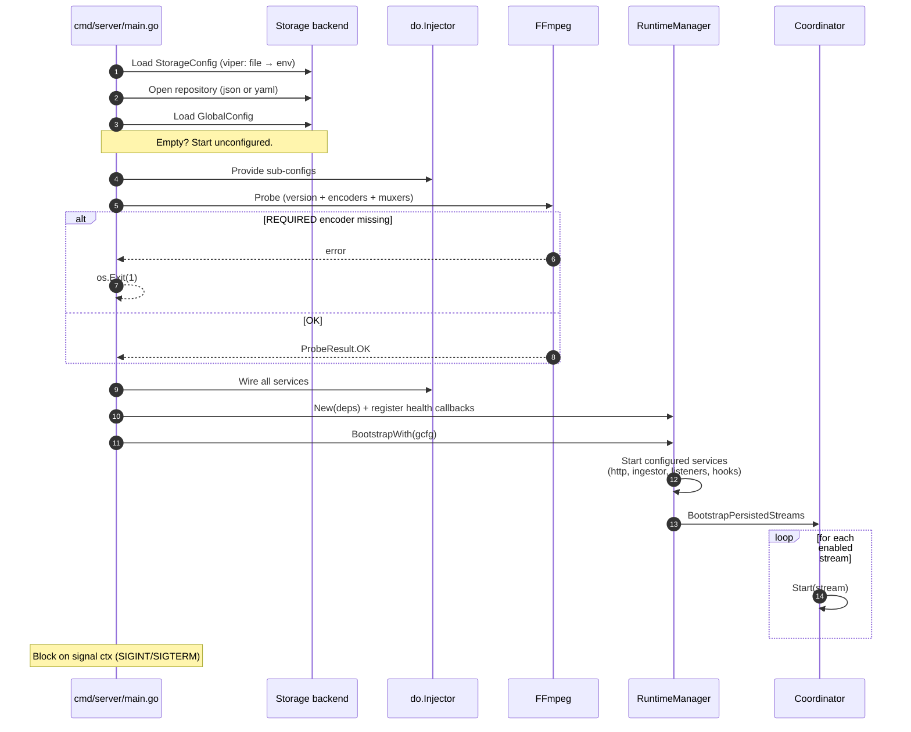
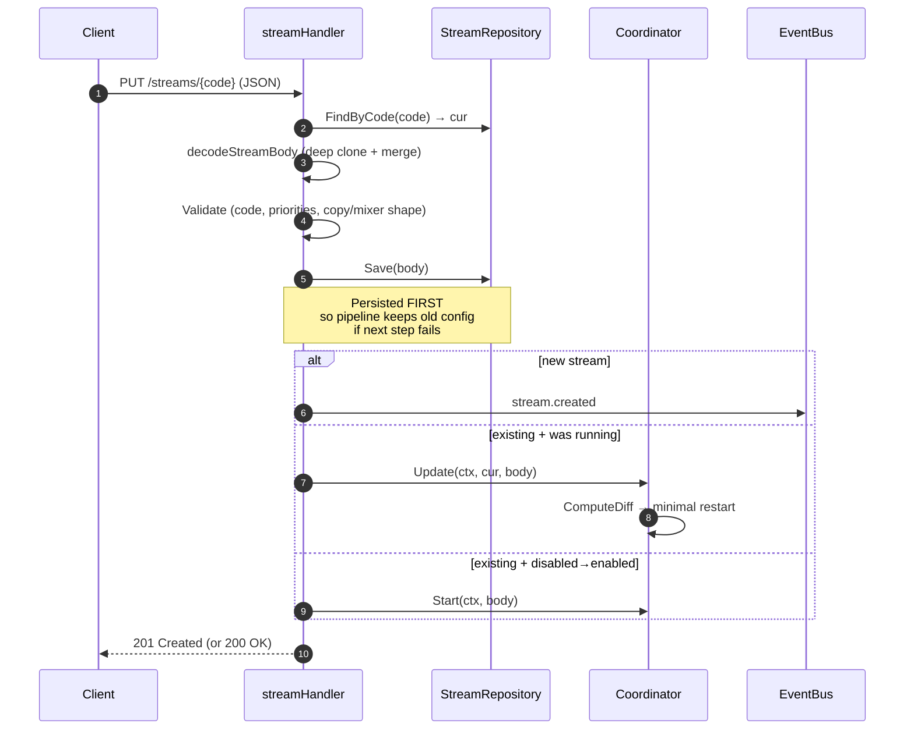
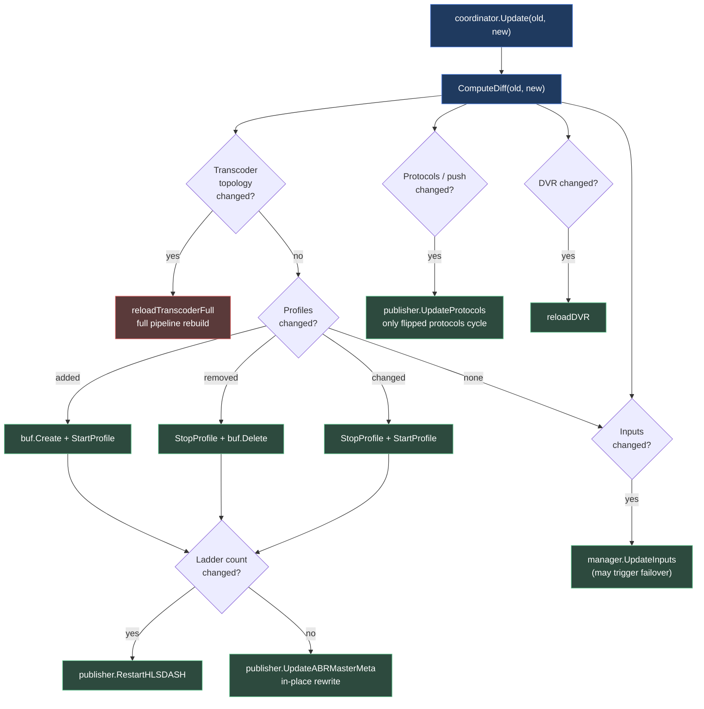
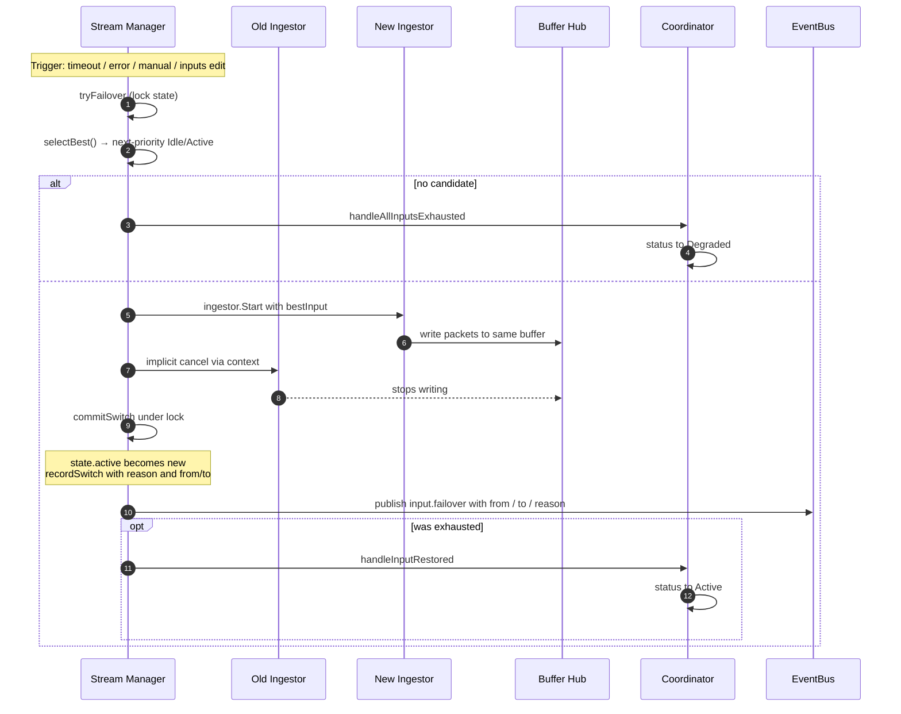
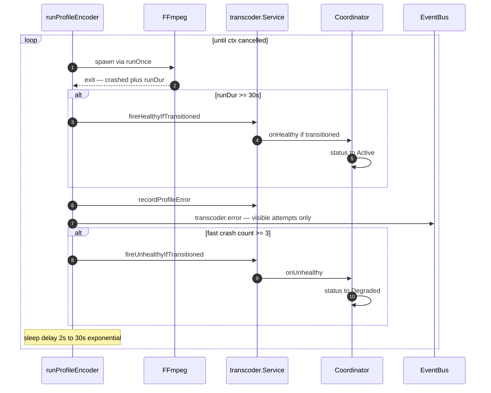
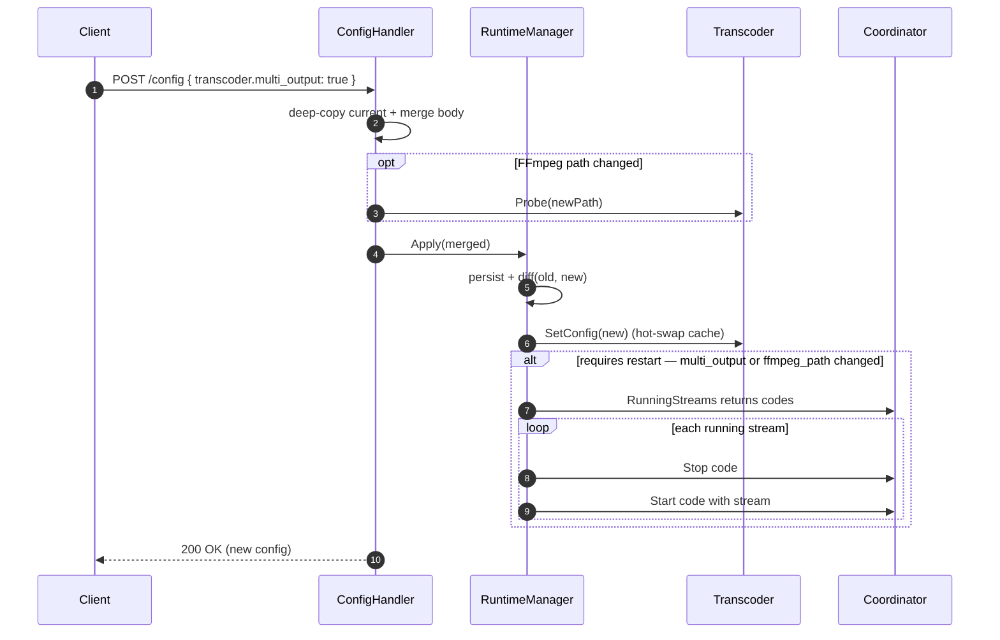
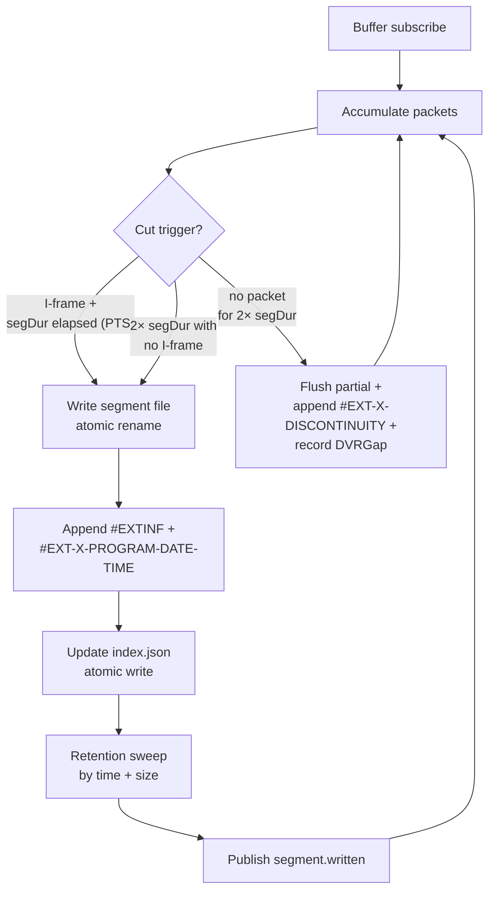
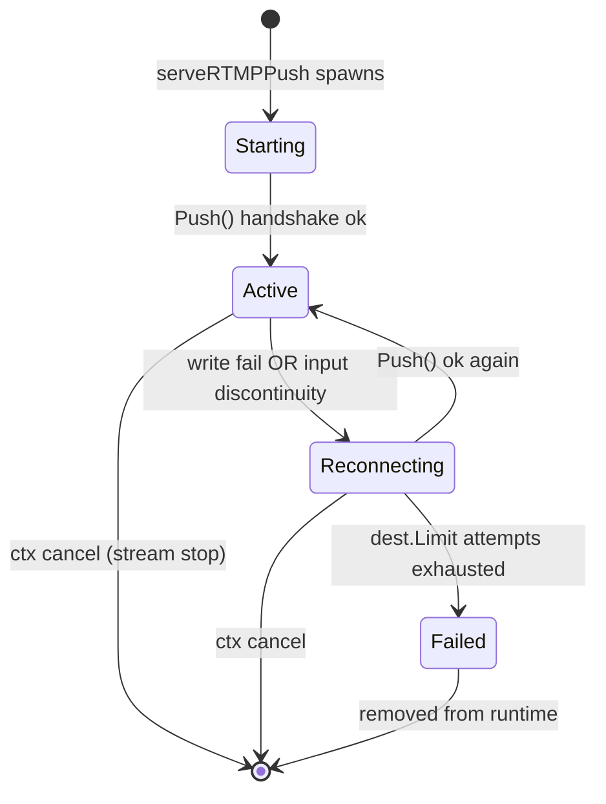
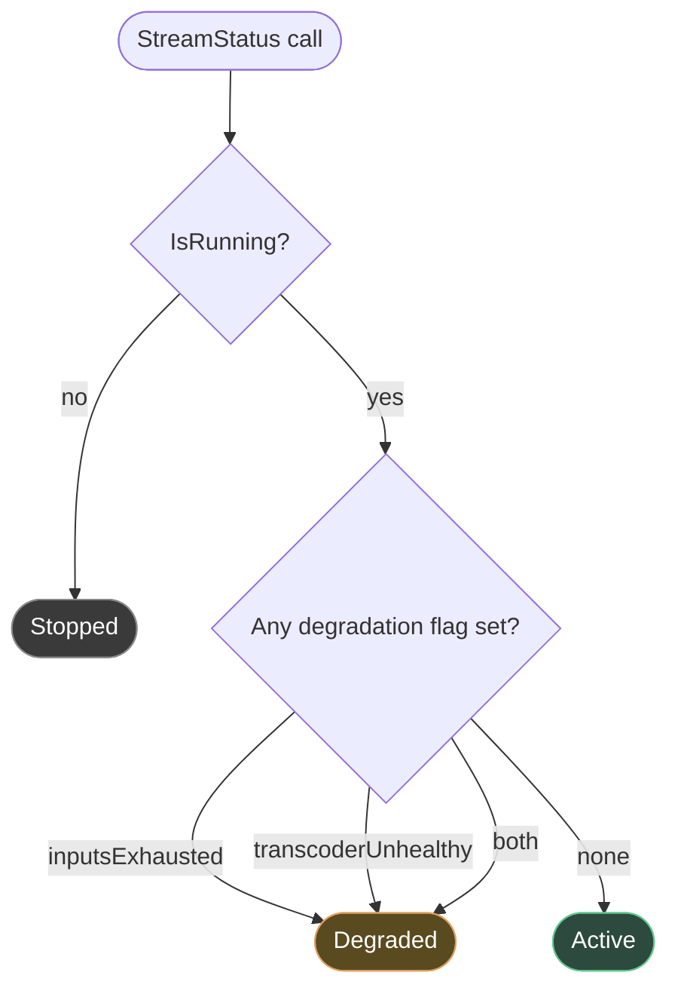

# Open Streamer — App Flow

Step-by-step traces of what happens during each major operation, plus
the full event reference. Companion to
[ARCHITECTURE.md](./ARCHITECTURE.md) (subsystem design) and
[USER_GUIDE.md](./USER_GUIDE.md) (operator workflows).

---

## 1. Server boot



```text
1.  cmd/server/main.go: load StorageConfig (viper)
                        ├── from config.yaml
                        └── from OPEN_STREAMER_* env (overrides file)

2.  Open storage backend (json or yaml)
    └── register repositories in DI: stream, hook, recording, vod, global_config

3.  Load GlobalConfig from store
    ├── if not found:  start unconfigured (empty struct)
    └── if found:      use it

4.  Provide sub-configs to DI: server, listeners, ingestor, buffer,
    transcoder, publisher, manager, hooks, log

5.  Init slog from GlobalConfig.Log

6.  ► Probe FFmpeg (transcoder.Probe)
    ├── runs `ffmpeg -version`, `-encoders`, `-muxers`
    ├── REQUIRED missing → fmt.Errorf → os.Exit(1) — fail fast
    └── OPTIONAL missing → slog.Warn per encoder, continue

7.  Wire all services (publisher, ingestor, transcoder, manager,
    coordinator, hooks, dvr, api)
    └── each constructor pulls deps from DI

8.  RuntimeManager.New(ctx, deps)
    └── set transcoder + manager callbacks (health → coordinator)

9.  ConfigHandler.SetRuntimeManager(rtm)  (breaks circular DI)

10. RuntimeManager.BootstrapWith(gcfg)
    ├── start each configured service (server, ingestor RTMP listener,
    │   publisher RTSP/SRT listeners, hooks)
    └── coordinator.BootstrapPersistedStreams
        └── for each stream in store where !disabled && len(inputs) > 0:
            └── coordinator.Start(stream)

11. Block on signal ctx (SIGINT / SIGTERM)
    └── on shutdown: services tear down in reverse, 10s deadline
```

---

## 2. Create a stream (PUT /streams/{code})



```text
1.  HTTP handler: streamHandler.Put(w, r)

2.  loadCurrentStream(code) → cur (or ErrNotFound)

3.  decodeStreamBody(req, code, cur, exists)
    ├── if exists: deep-clone via JSON round-trip → base
    │   └── (avoids pointer aliasing → silent diff swallow)
    └── json.Decode body onto base — present fields overwrite

4.  Validate
    ├── ValidateStreamCode (regex + length)
    ├── ValidateInputPriorities (must be 0..N-1 contiguous)
    ├── ValidateUniqueInputs (no duplicate URL)
    └── validateCopyConfig + validateMixerConfig (URL grammar + shape)

5.  streamRepo.Save(ctx, body)
    └── persisted FIRST so pipeline continues with old config if next
        step fails

6.  pipelineCtx = context.WithoutCancel(r.Context)
    └── coordinator goroutines outlive the HTTP request

7.  Branch on previous state:
    ├── existing + was running → coordinator.Update(ctx, cur, body)
    │                            └── diff engine → minimal restart
    ├── existing + disabled → enabled → coordinator.Start(ctx, body)
    └── new → bus.Publish(stream.created)

8.  Response 201 (new) or 200 (update) with body
```

### Coordinator.Update internals (step 6)



```text
ComputeDiff(old, new) → 5 independent flags:
    ├── inputsChanged
    ├── transcoderTopologyChanged       (nil ↔ non-nil OR mode flip)
    ├── profilesChanged                 (per-profile add/remove/update)
    ├── protocolsOrPushChanged
    └── dvrChanged

Routing:
    if transcoderTopologyChanged:
        └── reloadTranscoderFull       (full pipeline rebuild)
    else:
        if profilesChanged:
            for each diff:
                added:   buf.Create + StartProfile
                removed: StopProfile + buf.Delete
                changed: StopProfile + StartProfile
            if ladderCountChanged:
                └── publisher.RestartHLSDASH
            else:
                └── publisher.UpdateABRMasterMeta  (in-place rewrite)

        if inputsChanged:
            └── manager.UpdateInputs(added, removed, updated)
                ├── if active input removed → tryFailover(input_removed)
                ├── if higher-priority added → tryFailover(input_added)
                └── if active input updated → restart ingestor with new URL

        if protocolsOrPushChanged:
            └── publisher.UpdateProtocols(old, new)
                └── stops only protocols that flipped OFF
                └── starts only protocols that flipped ON
                └── live RTSP/SRT viewers preserved on unchanged protocols

        if dvrChanged:
            └── reloadDVR (toggle on/off, restart with new mediaBuf if
                playback buffer ID shifted)
```

---

## 3. Coordinator.Start — pipeline assembly

```
1.  Validate: not disabled, has inputs
2.  Detect topology
    ├── input[0] is `copy://X` AND X has ABR ladder → startABRCopy
    ├── input[0] is `mixer://...` AND X has ABR ladder → startABRMixer
    └── otherwise → normal path (below)

3.  Compute buffer layout
    ├── if shouldRunTranscoder(stream):
    │   ├── create $raw$<code> for ingest writes
    │   └── create $r$<code>$track_N for each profile
    └── else: create <code> only

4.  manager.Register(ctx, stream, bufferWriteID)
    └── spawns ingest worker for best-priority input (StatusActive)
    └── records initial switch event { from=-1, to=N, reason=initial }

5.  publisher.Start(ctx, stream)
    ├── for each protocol enabled: spawn goroutine
    │   ├── HLS:  segmenter loop reading sub.Recv()
    │   ├── DASH: tsBuffer → TSDemuxer → fMP4 segments
    │   ├── RTSP: register stream with shared listener for play
    │   ├── RTMP: register stream with shared listener for play
    │   └── SRT:  register stream with shared listener for play
    └── for each push destination enabled: spawn outbound goroutine
        └── lal PushSession → handshake → media loop

6.  if shouldRunTranscoder(stream):
        transcoder.Start(ctx, code, rawIngestID, tc, targets)
        ├── if cfg.MultiOutput:
        │   └── spawnMultiOutput(stream, sw, targets)
        │       └── one FFmpeg, N output pipes
        │       └── shadow profile workers for indices 1..N-1
        └── else:
            for each target:
                spawnProfile(stream, sw, idx, target)
                └── one FFmpeg per profile

7.  if stream.dvr.enabled:
        dvr.StartRecording(ctx, code, mediaBuf, dvrCfg)
        └── subscribes to playback buffer; segments to disk

8.  coordinator.clearDegradation(code) — fresh pipeline starts Active
9.  bus.Publish(stream.started)
```

---

## 4. Active-input failover



Triggered by manager when:
- packet timeout (`checkHealth` finds active input silent > timeout)
- ingestor reports error (`ReportInputError` from worker)
- manual switch (`SwitchInput` API)
- inputs config edit (`UpdateInputs` removed active OR added higher-priority)

```
tryFailover(streamID, state, reason, detail):
    1. lock state.mu
    2. selectBest(state) → next-priority Idle/Active input (or override
       priority if set)
    3. if nil → handleExhausted (set state.exhausted=true, fire
                onExhausted callback to coordinator)
       coordinator → updateDegradation(inputsExhausted=true)
                  → status flips to Degraded
    4. if best == active && !exhausted → skip (idempotent)
    5. capture prevPriority, bestInput, bufferWriteID, monCtx
    6. unlock state.mu
    7. ingestor.Start(monCtx, streamID, bestInput, bufferWriteID)
       └── new goroutine subscribes to source, writes Buffer Hub
    8. if start fails → return (no commit, retry next loop)
    9. commitSwitch(state, prevPriority, bestInput, reason, detail)
       ├── lock state.mu
       ├── prevH.Status = Idle (was Active)
       ├── state.active = bestInput.Priority
       ├── state.exhausted = false
       ├── state.lastSwitchAt = now
       ├── newH.LastPacketAt = now (handoff window)
       ├── recordSwitch(SwitchEvent{from, to, reason, detail, at})
       └── unlock state.mu
   10. metric: ManagerFailoversTotal.Inc()
   11. bus.Publish(input.failover{from, to, reason})
   12. notifyRestored() if wasExhausted → coordinator
       handleInputRestored → updateDegradation(inputsExhausted=false)
       └── status flips back to Active (if transcoder also healthy)
```

The old ingestor stops writing because its goroutine context is
cancelled by manager. The Buffer Hub continues — new ingestor writes to
the same buffer, downstream consumers see no gap (one
`#EXT-X-DISCONTINUITY` marker per HLS variant).

### Auto-reconnect recovery

Pull readers (HLS, RTMP, etc.) handle their own transient reconnects
at the library layer. When packets resume on a degraded active input,
the manager observes packet flow directly:

```text
RecordPacket(streamID, inputPriority):
    ├── h.LastPacketAt = now
    ├── if h.Status != Active:
    │   ├── h.Status = Active
    │   ├── h.Errors = nil
    │   ├── delete(state.degradedAt, inputPriority)
    │   └── if state.exhausted && inputPriority == state.active:
    │       ├── state.exhausted = false
    │       ├── recordSwitch(reason=recovery, detail="ingestor auto-reconnect")
    │       └── fire onRestored → coordinator → status Active
```

This complements the background probe path so single-input streams
recover the moment the upstream returns, regardless of probe cadence.

---

## 5. Transcoder crash + recovery



### Crash-restart loop (per profile)

```
runProfileEncoder(ctx, ...):
    delay := 2s
    consecutiveFastCrashes := 0
    for {
        startedAt := time.Now()
        crashed, err := runOnce(ctx, ...)
        runDur := time.Since(startedAt)

        if ctx.Err() != nil → return                  (clean shutdown)
        if !crashed → fireHealthyIfTransitioned + return  (graceful exit)

        if runDur >= 30s:                              (sustained run)
            consecutiveFastCrashes = 0
            fireHealthyIfTransitioned(stream, profile)

        recordProfileError(stream, profile, err.Error())
        metric: TranscoderRestartsTotal.Inc()

        if runDur < 30s:
            consecutiveFastCrashes++
            if consecutiveFastCrashes >= 3:
                fireUnhealthyIfTransitioned(stream, profile, errMsg)
                └── coordinator handleTranscoderUnhealthy
                    └── updateDegradation(transcoderUnhealthy=true)
                    └── status flips to Degraded

        // Spam suppression
        if errMsg == lastErrMsg: consecutiveSame++
        else: consecutiveSame = 1, lastErrMsg = errMsg
        visible := consecutiveSame <= 3 || isPowerOf2(attempt)
        if visible:
            slog.Warn(restarting, attempt, restart_in=delay)
            bus.Publish(transcoder.error)
        else:
            slog.Debug(suppressed)

        select {
        case <-ctx.Done(): return
        case <-time.After(delay):
        }
        delay = min(delay*2, 30s)
    }
```

### Health state edges (transcoder.Service)

`unhealthyProfiles map[StreamCode]map[int]struct{}` tracks per-(stream,
profile-index) failure state.

- `markProfileUnhealthy(stream, profileIdx)` returns true ONLY when the
  set transitions from empty → non-empty (first failing profile per
  stream)
- `markProfileHealthy(stream, profileIdx)` returns true ONLY when the
  set transitions from non-empty → empty (last failing profile cleared)
- `dropHealthState(stream)` (called from `transcoder.Stop`) wipes the
  set and fires `onHealthy` so hot-restart paths
  (Update → Stop → Start) leave coordinator status synchronised

The result: coordinator only sees state-change edges (not every
crash), so degradation transitions are clean.

---

## 6. Hot config update — transcoder.multi_output toggle



```text
1.  POST /api/v1/config { "transcoder": { "multi_output": true } }

2.  ConfigHandler.UpdateConfig:
    ├── deep-copy current GlobalConfig
    ├── json.Decode body onto copy → merged
    ├── if transcoderPathChanged(current, merged):
    │   └── validateTranscoderPath (probe binary)
    └── rtm.Apply(ctx, merged)

3.  RuntimeManager.Apply:
    ├── repo.Set(merged) — persist first
    ├── update m.current = merged
    └── m.diff(old, new)

4.  RuntimeManager.diff:
    ├── (other services diff first)
    └── if transcoder config changed:
        └── applyTranscoderChange(old, new)

5.  applyTranscoderChange:
    ├── transcoder.SetConfig(new)              (hot-swap cached cfg)
    ├── if transcoderRequiresRestart(old, new):
    │   ├── codes := coordinator.RunningStreams()
    │   └── for each code: m.restartStream(code)
    │       ├── repo.FindByCode(code)
    │       ├── if disabled → skip
    │       ├── coordinator.Stop(code)
    │       └── coordinator.Start(code, stream)
    └── else: log "no restart required"
```

Restart per stream takes ~2-3s (Stop teardown + Start fresh). Multiple
streams restart in parallel (one goroutine each).

---

## 7. DVR segment write



```text
DVR loop (per stream, subscribed to playback buffer):
    1. consume packets from sub.Recv()
    2. accumulate into pending segment
    3. cut on:
        ├── PTS-based: I-frame + segDur elapsed in PTS clock
        └── wall-clock fallback: 2 × segDur elapsed without I-frame

    4. on cut:
        ├── write segment file (stream-tmp + atomic rename)
        ├── append #EXTINF + #EXT-X-PROGRAM-DATE-TIME to playlist.m3u8
        ├── update index.json (atomic write)
        ├── retention sweep:
        │   ├── prune by retention_sec
        │   └── prune by max_size_gb
        └── bus.Publish(segment.written)

    5. on gap detected (no packet for 2 × segDur):
        ├── flush partial segment
        ├── append #EXT-X-DISCONTINUITY to playlist
        ├── append DVRGap{From, To, Duration} to index.json
        └── next segment cut also writes #EXT-X-PROGRAM-DATE-TIME
```

Resume after restart:
```
DVR.StartRecording (existing recording detected via index.json):
    ├── parsePlaylist(playlist.m3u8) → in-memory segment list
    ├── continue from highest segment number
    └── write #EXT-X-DISCONTINUITY (gap = restart downtime)
```

---

## 8. Push to remote (RTMP/RTMPS)

Per-destination state machine:



```text
serveRTMPPush(ctx, streamID, dest):
    setPushStatus(streamID, dest.URL, Starting)
    defer removePushState(streamID, dest.URL)

    retryDelay = dest.RetryTimeoutSec || 5s
    attempts := 0

    for {
        if ctx.Err() != nil: return
        if dest.Limit > 0 && attempts >= dest.Limit:
            setPushStatus(Failed)
            return

        attempts++
        setPushAttempt(streamID, dest.URL, attempts)

        ├── lal.PushSession.Push(dest.URL)  (blocks until handshake ack)
        ├── on success: setPushStatus(Active) → reset attempts, clear errors
        └── on failure:
            recordPushError(err.Error())
            setPushStatus(Reconnecting)
            sleep retryDelay
            continue

        // active media loop:
        for pkt := range sub.Recv():
            push_codec.go: convert AVPacket → FLV tag w/ proper composition_time
            session.WriteTag(tag)
            if write fail or input discontinuity:
                setPushStatus(Reconnecting)
                break  // outer loop reconnects
    }
```

Per-destination state in `runtime.publisher.pushes[]`:

```json
{
  "url":          "rtmp://a.rtmp.youtube.com/live2/KEY",
  "status":       "active",
  "attempt":      1,
  "connected_at": "2026-04-26T10:00:00Z",
  "errors":       []
}
```

On successful re-Active the `errors` and `attempt` reset — past
failures resolved. On transition Active→Reconnecting/Failed,
`connected_at` clears so UI uptime computation doesn't lie.

---

## 9. Status reconciliation

`runtime.status` is derived dynamically from two flags + pipeline state:



```text
StreamStatus(code):
    if !IsRunning(code):           return Stopped

    d := degradation[code]
    if d != nil && d.any():        return Degraded
                                   //    (inputsExhausted OR transcoderUnhealthy)
    return Active
```

**Sources of degradation:**

| Source | Set by | Cleared by |
|---|---|---|
| `inputsExhausted` | `manager.handleExhausted` → coordinator.handleAllInputsExhausted | manager success → coordinator.handleInputRestored |
| `transcoderUnhealthy` | `transcoder.fireUnhealthyIfTransitioned` (3 fast crashes) | sustained run >30s OR Stop (dropHealthState) |

Both flags must be clear for status to be Active. Clearing one while
the other is set keeps the stream Degraded.

`Start` paths (`coordinator.Start`, ABR copy/mixer start) call
`clearDegradation` to reset the entry — fresh pipelines never inherit
stale degraded state from prior runs.

---

## 10. Events reference

All events flow through `internal/events.Bus` and are delivered to
hooks matching the event type filter.

### Event envelope

```json
{
  "id":          "test-1712345678901234567",
  "type":        "stream.created",
  "stream_code": "my-stream",
  "occurred_at": "2026-04-27T12:00:00Z",
  "payload":     { ... }
}
```

| Field | Type | Description |
|---|---|---|
| `id` | string | Unique event ID (nano-timestamp prefix). Use for idempotent delivery |
| `type` | string | Event type (see table) |
| `stream_code` | string | Stream this event belongs to |
| `occurred_at` | RFC 3339 | Wall time the event was emitted |
| `payload` | object | Event-specific fields. May be absent when there are no extras |

### Stream lifecycle

Published by API handler + Coordinator.

| Type | When | Payload |
|---|---|---|
| `stream.created` | New stream persisted (`POST /streams/{code}` for non-existing code) | — |
| `stream.started` | Pipeline started (`coordinator.Start` complete) | — |
| `stream.stopped` | Pipeline torn down (manual stop, server shutdown, or pipeline error) | — |
| `stream.deleted` | Stream removed from store | — |

### Input health

Published by Manager + Ingestor.

| Type | When | Payload |
|---|---|---|
| `input.connected` | Pull input opened, first read loop started | `input_priority`, `url` |
| `input.reconnecting` | Transient read error; worker about to sleep before retry | `input_priority`, `error` |
| `input.degraded` | Active input declared dead (timeout or ingestor error) | `input_priority`, `reason` |
| `input.failover` | Manager switched active input | `from`, `to`, `reason` (initial/error/timeout/manual/failback/recovery/input_added/input_removed) |
| `input.failed` | Pull worker exited (EOF, non-retriable error, ctx cancel) | — |

Reconnect sequence example:
```
input.connected     ← source OK
input.reconnecting  ← transient error, sleeping
input.connected     ← reconnected
input.failed        ← context cancelled (stream stopped)
```

### Transcoder

Published by transcoder service + worker loops.

| Type | When | Payload |
|---|---|---|
| `transcoder.started` | All FFmpeg workers launched for a stream | `profiles` (int), `raw_ingest_id`, `mode` (`per_profile` / `multi_output`) |
| `transcoder.stopped` | All FFmpeg processes for a stream exited | — |
| `transcoder.error` | Single FFmpeg process exited non-zero outside controlled shutdown | `profile` (e.g. `track_1`), `attempt`, `restart_in_sec`, `error` (with stderr-tail) |

`transcoder.error` does NOT stop the stream — other profile encoders
keep running. After 3 consecutive fast crashes the coordinator marks
the stream Degraded (visible via `runtime.status`); does not auto-stop.

### DVR / Recording

Published by DVR service.

| Type | When | Payload |
|---|---|---|
| `recording.started` | `StartRecording` complete; first segment incoming. Fires on fresh start AND resume after restart | `recording_id` |
| `recording.stopped` | `StopRecording` complete; playlist sealed as VOD | `recording_id` |
| `recording.failed` | Segment write failed (disk full, permission, etc.). Recording loop continues | `recording_id`, `segment`, `error` |
| `segment.written` | TS segment flushed to disk. **HIGH-FREQUENCY** — one per cut (~4s default) | `recording_id`, `segment`, `duration_sec`, `size_bytes`, `wall_time`, `discontinuity` |

### Volume guide

| Event | Typical frequency |
|---|---|
| `stream.created` / `deleted` | Rare — operator action |
| `stream.started` / `stopped` | Rare — operator action or full failover |
| `input.connected` / `failed` | Low — per reconnect cycle |
| `input.reconnecting` / `degraded` / `failover` | Low — only on signal problems |
| `recording.started` / `stopped` / `failed` | Low |
| `transcoder.started` / `stopped` / `error` | Low (error suppressed after threshold) |
| `segment.written` | **HIGH** — one per segment cut (~4s) |

Hooks that don't want segment.written should set `event_types`
explicitly to filter it out:

```json
{
  "type":        "http",
  "target":      "https://ops.example.com/events",
  "event_types": ["stream.started","stream.stopped","input.failover","transcoder.error"]
}
```

---

## 11. Hook delivery

### HTTP hooks

- Method: `POST`
- Body: JSON event envelope
- HMAC: `X-OpenStreamer-Signature: sha256=<hex>` when `secret` is set
- Retries: up to `max_retries` (default 3) with backoff 1s / 5s / 30s
- Timeout: per-hook `timeout_sec` (default 10)

### Kafka hooks

- Topic: hook's `target` field
- Message key: `stream_code`
- Message value: JSON event envelope
- Brokers: `hooks.kafka_brokers` (shared by all Kafka hooks)
- Writer: lazy-initialized per topic, reused across deliveries

### Filter examples

```json
{ "event_types": ["transcoder.error"], "stream_codes": { "only": ["news"] } }
{ "event_types": ["input.failover"],   "stream_codes": { "except": ["test_*"] } }
{ "event_types": [] }    // all events, all streams
```

---

## See also

- [USER_GUIDE.md](./USER_GUIDE.md) — install + workflows
- [CONFIG.md](./CONFIG.md) — every config field
- [ARCHITECTURE.md](./ARCHITECTURE.md) — design rationale
- [FEATURES_CHECKLIST.md](./FEATURES_CHECKLIST.md) — what's implemented
