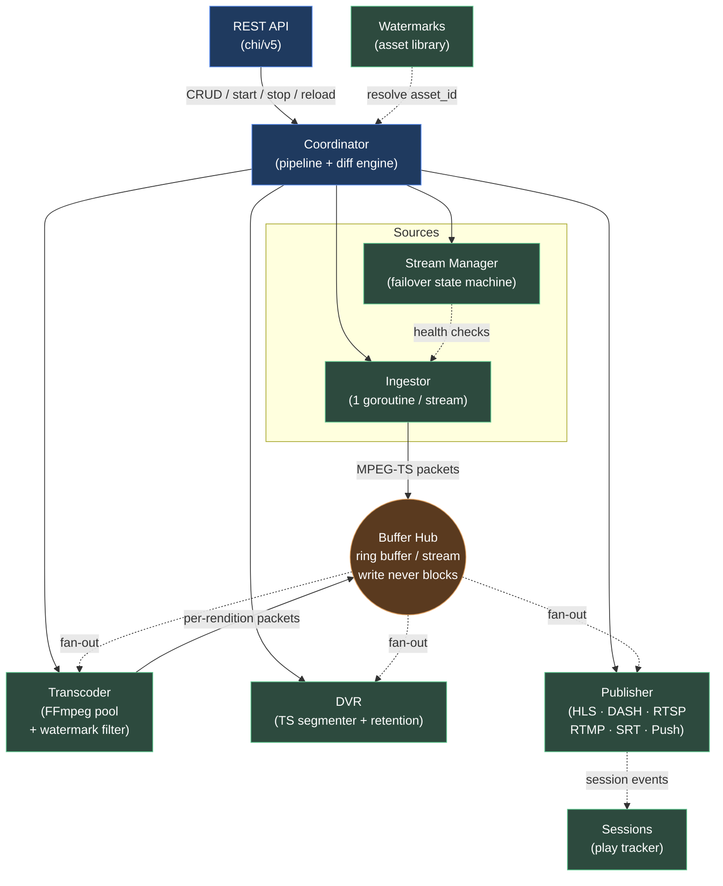
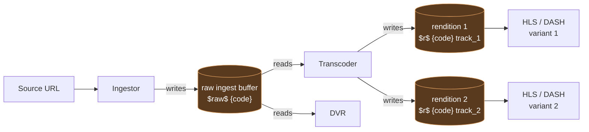
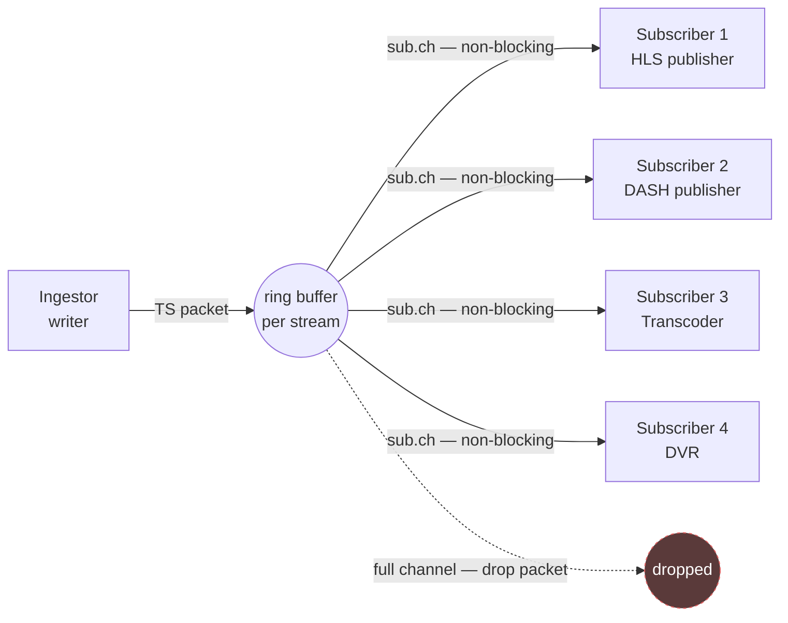
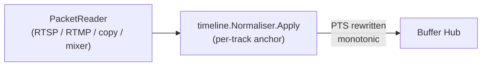
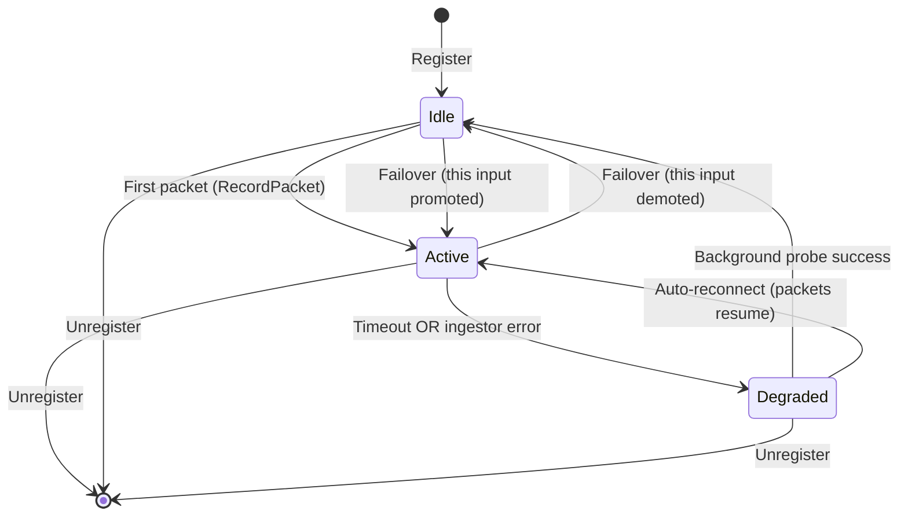
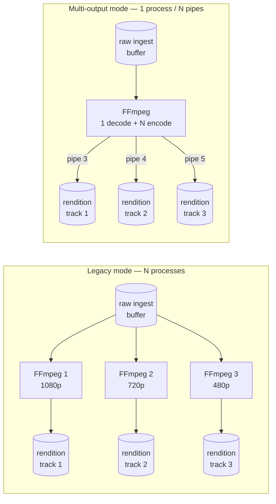
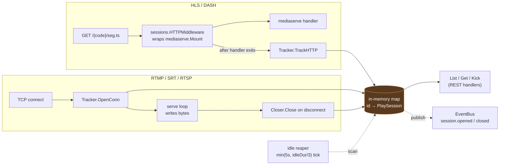
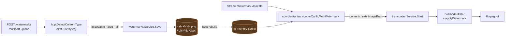
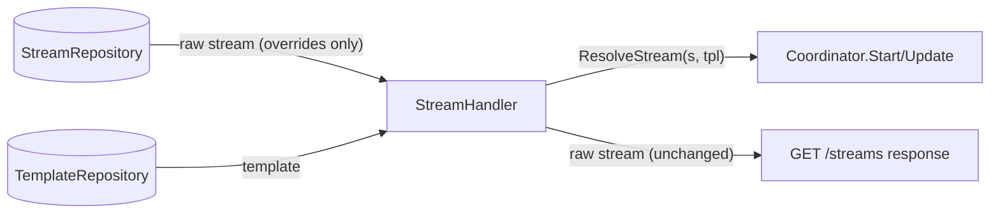
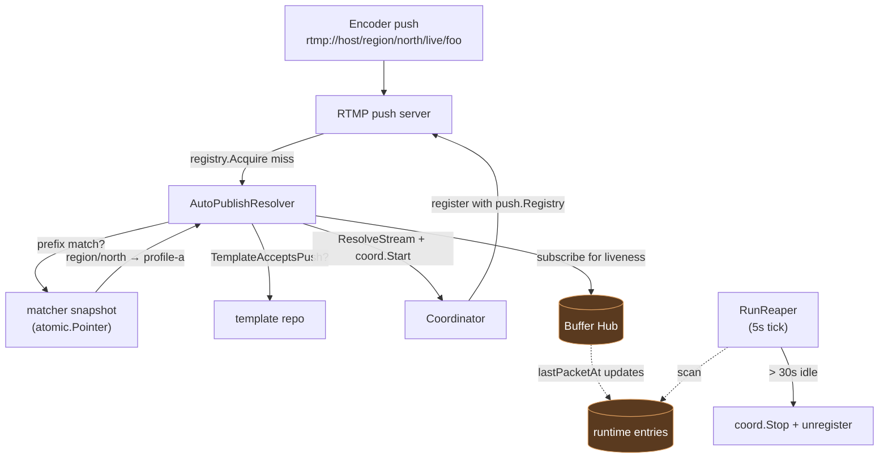

# Open Streamer — Architecture

How the system is wired and **why**. For the operator-facing config see
[CONFIG.md](./CONFIG.md); for end-to-end pipeline traces see
[APP_FLOW.md](./APP_FLOW.md).

---

## 1. Design mindset

Five non-negotiable rules drive every component:

1. **Buffer Hub is the only data source.** No consumer (publisher,
   transcoder, DVR, manager probe) ever reads from the network or a
   sibling module directly. This makes the data path testable end-to-end
   and decouples ingest topology from output topology.

2. **Failover is a Go-level operation.** The Stream Manager swaps the
   active input by stopping the old ingestor goroutine and starting a
   new one — **FFmpeg is never restarted for failover**. Buffer continuity
   means downstream HLS playlists just emit a `#EXT-X-DISCONTINUITY`
   marker; players resume immediately.

3. **One goroutine per ingest stream, not one process.** Pull workers
   live in the same address space, share connections to the storage
   layer, and tear down with `context.Cancel`. No process supervision.
   The single FFmpeg subprocess we spawn is for transcoding only.

4. **Write never blocks.** The Buffer Hub's fan-out uses non-blocking
   sends (`select { case ch <- pkt: default: }`). Slow consumers
   silently drop packets — the ingestor and the upstream connection are
   shielded from any single laggard. This is the most important
   invariant in the codebase: violating it would let a stuck DVR writer
   freeze every viewer.

5. **Hot-reload by diff, never by restart.** `PUT /streams/{code}`
   computes a structured diff of the persisted record and routes each
   change to the minimal set of service calls. Adding a push
   destination doesn't disturb HLS viewers; toggling DASH doesn't drop
   RTMP push sessions; changing one ABR rung restarts only that
   FFmpeg.

Two derived rules:

- **Modules talk through interfaces.** No sibling-module imports — the
  coordinator is the only place that knows about ingestor + manager +
  transcoder + publisher + DVR together.
- **`internal/store/` owns all persistence.** Other modules never
  import database drivers.

---

## 2. High-level topology



**Two buffer namespaces** when transcoder is active:



Without transcoder, the layout collapses to a single `<code>` buffer
written by the ingestor and read by publishers + DVR.

---

## 3. Subsystems

### Coordinator (`internal/coordinator`)

Wires the per-stream pipeline on `Start` / `Stop` / `Update`. Owns no
data path — pure orchestration.

**`Start`** sequence:
1. Detect topology (legacy ABR vs ABR-copy vs ABR-mixer) from inputs
2. Create raw + rendition buffers as needed
3. Register stream with Manager (which spawns ingest worker)
4. Start Publisher goroutines for enabled protocols + push destinations
5. Optionally start Transcoder workers (one per profile, OR one
   multi-output for the whole stream)
6. Optionally start DVR

**`Update(old, new)`** runs the **diff engine** — 5 independent change
categories:
- **inputs** — Manager.UpdateInputs (add/remove/update without stopping
  the active worker)
- **transcoder topology** — nil↔non-nil or mode change → full pipeline
  rebuild (`reloadTranscoderFull`)
- **profiles** — Add/remove individual rungs:
  - changed: `StopProfile + StartProfile`
  - added: `buf.Create + StartProfile`
  - removed: `StopProfile + buf.Delete`
- **protocols / push** — Publisher.UpdateProtocols (only changed
  protocols cycle; live RTSP viewers preserved)
- **DVR** — toggle on/off; restart with new mediaBuf if best rendition
  shifted

**Status reconciliation** — coordinator tracks per-stream
`streamDegradation { inputsExhausted, transcoderUnhealthy }`. Stream is
`Active` iff every flag is clear; `Degraded` if any flag is set;
`Stopped` when not registered. Manager and Transcoder push their flag
state via callbacks; coordinator never polls them.

**Pipeline reconciler** — `Coordinator.RunReconciler` is a long-running
goroutine started once at boot by the runtime Manager. Every 10s it
re-lists every persisted stream and `Start`s any non-disabled stream
with at least one input that the coordinator is not currently running.
This is the safety net behind every code path that can leave a stream
stopped against the operator's intent — bootstrap `Start` failures from
a transient HLS source outage, restart errors, or the `POST /streams`
edge case where a brand-new stream is saved but the create handler
never dispatches `Start`. Idempotent: `Start` short-circuits when the
pipeline is already running, so concurrent API operations race safely
against the loop.

### Buffer Hub (`internal/buffer`)

The single source of truth for stream data. One in-memory ring buffer
per stream code. Each consumer (Publisher, Transcoder, DVR) gets an
independent `*Subscriber` with its own bounded channel.



```go
// Write never blocks.
func (rb *ringBuffer) write(pkt TSPacket) {
    rb.mu.RLock()
    for _, sub := range rb.subs {
        select {
        case sub.ch <- pkt:
        default:                  // ← packet dropped silently
        }
    }
    rb.mu.RUnlock()
}
```

**Capacity**: subscriber channel is `buffer.capacity` packets (default
1024 ≈ 1MB ≈ 1.5s of 1080p60 @ 5Mbps). HLS pull bursts (one segment
per Read) need this headroom; RTMP/SRT trickle is fine on smaller
sizes.

When ABR is active, ingest writes to `$raw$<code>` (transcoder reads
that), and transcoder writes per-rendition to `$r$<code>$track_N`
(publishers read those). The split keeps DVR recording the original
source rather than a transcoded variant.

### Ingestor (`internal/ingestor`)

One goroutine per stream — never one process. URL scheme drives
protocol selection via `pull.PacketReader` factory:

| Scheme | Reader | Backing lib |
|---|---|---|
| `rtmp://` | RTMPReader | `q191201771/lal` PullSession + AVCC→Annex-B + ADTS wrap |
| `rtsp://` | RTSPReader | `bluenviron/gortsplib/v5` |
| `srt://` | SRTReader | `datarhei/gosrt` |
| `udp://` | UDPReader | stdlib net.UDPConn + RTP-strip |
| `http(s)://...m3u8` | HLSReader | `grafov/m3u8` parser |
| `http(s)://...ts` | HTTPReader | stdlib net.Client |
| `file://` | FileReader | stdlib os.File + paced playback |
| `s3://` | S3Reader | `aws-sdk-go-v2` |
| `copy://` | CopyReader | in-process buffer subscription |
| `mixer://video,audio` | MixerReader | in-process video+audio mix; each track's PTS is locally normalised to a 0-relative origin (videoPTSBase / audioPTSBase) so unrelated upstream clocks don't poison the per-track delta math. Cross-track sync (V and A landing on the same wallclock axis) is delegated to the PTS anchoring layer below. |

**Push ingest** (RTMP listen `:1935`, SRT listen `:9999`) shares a
single server per protocol. Incoming connection → registry lookup
(streamid / RTMP app+key) → dispatch to a loopback PullSession that
feeds the Buffer Hub through the same code path as pull mode. The
loopback architecture means RTMP/SRT push streams use the same stable
codec normalisation as pulls, no special-casing.

**Reconnect** is automatic — pull readers retry with their own internal
strategies (`gortsplib`, `lal`, etc.). The manager's per-input
`packet_timeout` is the safety net.

### Timeline Normaliser (`internal/timeline`)

Single unification of the three legacy PTS rebasers. Replaced:

- `internal/ingestor/ptsrebaser` (AV-path)
- `internal/ingestor/pull/mixer` `videoPTSBase`/`audioPTSBase`
- `internal/coordinator/abr_mixer`'s per-cycle rebaser

Sits between every AV-path `PacketReader` and the buffer-hub write
(invoked from `ingestor/worker.writeOnePacket` → `normaliser.Apply`).
Without it, the upstream encoder's clock chooses the timeline that ends up
in HLS / DASH manifests — and live encoders out in the wild routinely run
a fraction of a percent off NTP, sudden-jump on CDN HLS playlist resync,
or restart with a fresh PTS origin. Any of those produce a segment
timeline whose media-time runs ahead of `publishTime`, which strict DASH
players (dashjs / shaka) then refuse to play because `(now − AST) −
liveDelay` lands before the earliest available segment.

The Normaliser solves it by anchoring each track to **local wallclock** at
first packet, then preserving inter-frame deltas as long as they don't
drift past the configured threshold:



State is **per track** (video / audio independently). On the first packet of
a track:

- `outputAnchor = (now − wallOrigin)` ms — current elapsed wallclock since
  the FIRST observed packet of any track. Preserves any small intrinsic A/V
  offset (RTSP audio leading video by ~100 ms, RTMP codec-config pre-roll).
- `inputOrigin = packet.DTSms` — anchor for delta math going forward.
- **Cross-track snap**: if the OTHER track has already moved more than
  `CrossTrackSnapMs` (1 s) of output PTS by the time this track seeds —
  typical for `mixer://` where one source bursts in milliseconds while the
  other delivers steadily — this track's `outputAnchor` is snapped onto the
  other track's `lastOutputDts` so V and A start in lockstep.

For every subsequent packet:

```text
expected = outputAnchor + (packet.DTSms − inputOrigin)
```

A re-anchor fires when:

- The proposed output regresses past `lastOutputDts` (input went backward —
  source restart, PTS wrap, mid-burst monotonic violation), OR
- Drift `expected − max(actualNow, lastOutputDts)` exceeds
  `JumpThresholdMs` (2 s): catches forward jumps from CDN playlist resync
  / NVENC stall recovery / transcoder restart, OR
- `MaxBehindMs` is configured and the running output position lags wallclock
  by more than that (track paused while wallclock moved on).

`MaxAheadMs` provides a forward drift cap independently: when the proposed
output would land more than that many ms ahead of `(now − wallOrigin)`, the
packet is **dropped** (returns `Apply == false` so the caller skips the
buffer write). Default 0 disables the drop; raise it for sources known to
burst beyond `JumpThresholdMs` worth of media in one wallclock millisecond.

The `max(actualNow, lastOutputDts)` floor is load-bearing — bursty delivery
(RTMP pulls regularly batch a GOP-worth of frames into one ms of wallclock)
would otherwise manufacture a "drift" inside the burst and trip the
re-anchor on every other frame. Comparing against the running output
position absorbs the burst.

Output is always monotonic: re-anchors use `target = max(actualNow,
lastOutputDts + 1)` so downstream uint64 dur math (DASH packager, MSE
source buffer) can never underflow.

**Session boundaries** moved from per-packet `Discontinuity` flags onto
`buffer.Packet.SessionStart` (Phase-3 refactor). The Normaliser's
`OnSession(reason, t)` resets per-track state at the start of every new
session lifetime; consumers (DASH packager, HLS segmenter, RTSP/RTMP
re-stream) dispatch on `SessionStart=true` instead of multi-source
`Discontinuity` flags.

**Scope**: AV-path codecs only (RTSP / RTMP pull, RTMP push, `copy://`,
`mixer://`). Raw-TS sources (UDP / HLS-pull / HTTP-TS / SRT / file) are
demuxed → run through the Normaliser per-PES → remuxed via the
`internal/ingestor/tsnorm` wrapper, then ride the raw-TS chunk path
through the buffer hub. Residual quality-of-service items tracked in
`docs/DASH_OUTSTANDING_BUGS.md`.

**Known limitation**: `mixer://` combining two clock-independent sources
(e.g. live HLS video + file-paced audio) accumulates A/V drift mid-stream
that the seed-time cross-track snap can't fix. The bursty source's GOP-by-
GOP delivery keeps producing micro-drift that compounds over time. HLS
players load slowly (waiting for V/A to align in their buffer) but
eventually play. Documented as a known limitation; production mixer usage
should pair clock-coherent sources.

### Stream Manager (`internal/manager`)

Owns failover. Each stream registered with N inputs gets a `streamState`
with per-input `InputHealth` tracking:

- `lastPacketAt` — updated by `RecordPacket` on every ingest packet
- `Status` — `Idle` / `Active` / `Degraded` / `Stopped`
- `Errors[]` — last 5 degradation reasons with timestamps

Per-input health follows a small state machine:



Health check loop (every `monitorInterval=2s`):

- Active input silent > `input_packet_timeout_sec` → mark `Degraded` +
  fire failover
- Degraded inputs probed in background after `failbackProbeCooldown=8s`
- Probe success on a higher-priority input → `failback` switch
  (cooldown `failbackSwitchCooldown=12s`)

Failover commit:
1. `selectBest()` picks lowest-priority `Idle`/`Active` input (or
   override priority if set via manual switch)
2. `ingestor.Start(newInput)` — new goroutine spawns
3. `commitSwitch()` — atomically updates `state.active` + records the
   `SwitchEvent` in rolling history (last 20)

**Switch reasons** tracked in `runtime.switches[]`:

| reason | Trigger |
|---|---|
| `initial` | Register's first activation (`from=-1`) |
| `error` | `ReportInputError` from ingestor |
| `timeout` | Packet timeout in checkHealth |
| `manual` | Operator's `POST /inputs/switch` |
| `failback` | Higher-priority input recovered via probe |
| `recovery` | Exhausted state cleared (active died → probe / packet flow brought it back) |
| `input_added` | UpdateInputs added higher-priority entry |
| `input_removed` | UpdateInputs deleted active entry |

**Auto-reconnect recovery**: pull readers (HLS, RTMP, etc.) handle
their own transient reconnects at the library layer. When packets
resume on a degraded active input ahead of the manager's probe cycle,
`RecordPacket` clears the exhausted flag and records a `recovery`
switch so coordinator status flips back to Active.

### Transcoder (`internal/transcoder`)

Each ABR rung is one FFmpeg subprocess (legacy mode) OR all rungs share
one FFmpeg with N output pipes (multi-output mode).



**Legacy mode** (default):

- N FFmpeg processes per stream (1 per profile)
- Each subscribes to `$raw$<code>` independently
- Each writes to its own `$r$<code>$track_N` rendition buffer
- One profile crash → just that rung restarts

**Multi-output mode** (`transcoder.multi_output=true`):

- 1 FFmpeg process per stream
- Single decode → N video filter chains → N encoders → N output pipes
  (`pipe:3`, `pipe:4`, ... via `cmd.ExtraFiles`)
- Parent reads each pipe in its own goroutine → fans out to rendition
  buffer
- Saves ~50% NVDEC sessions + ~40% RAM per ABR stream
- Trade-off: one input glitch interrupts all profiles together
  (~2-3s) instead of just one rendition

The `streamWorker` map tracks profile workers under per-(stream,
profile-index) keys. Multi-output uses **shadow `profileWorker`
entries** for indices ≥ 1 — same shape so the existing
`recordProfileError` / `RuntimeStatus` paths see N rungs uniformly,
even though only index 0 owns the real goroutine.

**Encoder routing** (`domain.ResolveVideoEncoder`):
- `codec=""` + `hw=nvenc` → `h264_nvenc`
- `codec=""` + `hw=none` → `libx264`
- `codec="h265"` + `hw=nvenc` → `hevc_nvenc`
- explicit names (`h264_nvenc`, `h264_qsv`) preserved verbatim

**Preset normalization** (`normalizePreset`):
- `veryfast` + NVENC → `p2` (translate)
- `medium` + libx264 → `medium` (passthrough)
- `p4` + libx264 → `medium` (translate)
- garbage value → `""` (drop, encoder uses default — never crash on
  invalid syntax)

**Crash auto-restart**: per-profile loop with exponential backoff (2s →
30s cap). Retries forever — pipeline never tears down on FFmpeg
failure. Spam suppression: after 3 consecutive identical errors, warn
drops to debug; events fire only on power-of-2 attempts. `restart_count`
+ last 5 errors stay visible via `runtime.transcoder.profiles[]`.

**Health detection**: each profile loop tracks consecutive fast
crashes (under 30s). Crossing 3 fires `onUnhealthy` to coordinator →
status Degraded. A sustained run (≥30s) fires `onHealthy` → status
back to Active. Stop / hot-restart paths also fire `onHealthy` so a
freshly-started transcoder always begins from a healthy baseline.

**Pure-GPU pipeline** (NVENC): `decode → scale_cuda → encode` with no
CPU round-trip via hwdownload. All resize modes (`pad`/`crop`/`stretch`/
`fit`) execute on GPU; `pad`/`crop` degrade to aspect-preserving fit
(no server-side letterbox) since the cuda filter graph has no native
crop/pad primitives.

### Publisher (`internal/publisher`)

Reads from Buffer Hub subscriber, segments into output formats:

- **HLS** ([hls.go](../internal/publisher/hls.go)): processes
  `sub.Recv()` directly in main loop — no intermediate goroutine, no
  blocking. AV-path segmenting is keyframe-aligned: `handleAVPacket`
  flushes the current segment before writing an IDR once `segDur` has
  elapsed. The wallclock safety net at `maxDur = 4 × segDur` only fires
  for pathological long-GOP sources (source GOP > 4 × segDur); when it
  does, the segmenter latches `discardUntilIDR` so subsequent **video**
  packets are dropped until the next keyframe — guaranteeing every
  emitted segment starts at a clean IDR boundary. **Audio is exempt**
  from the discard window (`Codec.IsVideo() == false`); dropping audio
  during the 3–4 s wait would produce audible stutter at every force-
  flush, so audio elementary stream stays continuous through the gap.
- **DASH** ([internal/publisher/dash/](../internal/publisher/dash/) package):
  rewrote the original `dash_fmp4.go` monolith into discrete files —
  `packager.go` (Run loop, queue ingress, segment emit), `segmenter.go`
  (cut decision), `frame_queue.go` (per-track buffer), `fmp4_writer.go`
  (init + fragment), `manifest.go` (MPD), `state.go` (pairing window),
  `abr.go` (ABR ladder + master MPD), `aac.go` (ADTS bundle splitter).
  Each < 300 LOC, single-responsibility, table-test coverage.

  Run loop ticks 50 ms. Both `onTSFrame` (gomedia TSDemuxer callback for
  raw-TS path) and `onAVPacket` (direct AV path) feed the same
  `handleH264` / `handleAAC` ingress into a per-track `FrameQueue`.
  Init segments built lazily on first IDR (video) and first ADTS header
  (audio); pairing window (`StateWaitingForPairing → Live`) ensures the
  first segment starts at the SAME media-time anchor on both tracks.

  Three layered correctness guarantees:

  1. **`splitADTSBundle`** in `handleAAC`: gomedia's TSDemuxer delivers
     4–8 ADTS frames per AAC PES (encoders bundle for transmit
     efficiency). Without splitting, `writeAudioSegment`'s
     `len(frames) × 1024` segment-dur math collapses the sample count
     by the bundling factor and the audio MPD timeline lags wallclock
     by 80 % (root cause of stream_a / test_copy / test1 / test_mixer
     audio at ~20 % rate before fix). Splitter emits per-frame PTS =
     base + `frameIdx × 1024 × 1000 / sampleRate`.
  2. **First-IDR-past-segDur cut** in `segmenter.findIDRCutPoint`: HLS-
     pull bursts dump multi-GOP chunks into the queue. The legacy
     "trailing IDR in window" choice picked an IDR many seconds past
     the segDur boundary and produced segments whose frame-PTS span
     exceeded the inter-cut wallclock interval, baking MPD timeline
     overlaps. Switching to first IDR past segDur caps the span.
  3. **`behindPrevSegEnd` pacing gate** in `tryCut`: holds emit while
     `wallclockTicks(now, AST) < prev_seg_end_ticks` (per-track).
     Without the gate, two cuts within a raw-TS burst produce
     overlapping `<S t=...>` entries that strict players reject.

  Video segment dur = `next_frame.PTS − first_frame.PTS` (peek
  `videoPTSAt(VideoCount)` before `PopVideo`) so the last frame's own
  duration is included — using `last.PTS − first.PTS` under-reports by
  one inter-frame interval and visibly stutters every segment boundary
  on player. Audio segment dur = `len(frames) × 1024` ticks (sample-
  count-exact).

  tfdt is wallclock-anchored: `wallclockTicks(now, AST, timescale)`. The
  pacing gate enforces `wallclock ≥ prev_end`, so emits never overlap
  but may have small (≤ tick granularity 50 ms) gaps in MPD `<S t=...>`
  for paced sources. Sequential-vs-wallclock tfdt is a known
  trade-off — see `docs/DASH_OUTSTANDING_BUGS.md` for the in-progress
  smoothness fix.
- **RTMP / SRT** ([listen.go](../internal/publisher/listen.go)):
  shared listeners; per-client subscribes to the playback buffer.
  RTMP play out
  ([serve_rtmp.go](../internal/publisher/serve_rtmp.go) →
  [push/rtmp_writer.go](../internal/ingestor/push/rtmp_writer.go))
  preloads the AVCDecoderConfigurationRecord once per session by
  scanning raw TS for SPS/PPS (gomedia's TSDemuxer often drops
  standalone parameter-set NALUs before invoking `OnFrame`), strips
  SPS/PPS/AUD/SEI from per-frame video tags via `buildAvccSliceOnly`
  for strict-player compatibility (strict players reject NALU
  tags that contain non-slice NALUs), and **splits gomedia-bundled
  AAC PES into one RTMP audio tag per ADTS frame** with monotonic
  per-frame DTS — without splitting, a downstream pull-RTMP consumer
  collapses 4–8 frames into a single AVPacket and audio sample counts
  on the receiver under-report by the bundling factor.
- **RTSP** ([serve_rtsp.go](../internal/publisher/serve_rtsp.go)):
  shared listener (gortsplib v5). The pipeline holds each AV packet
  until its target wallclock arrives before `WritePacketRTP` so bursty
  upstream delivery (HLS pulls feeding segments every ~5s, NVENC's
  faster-than-realtime output) reaches the wire smoothed back to
  realtime — without this, strict clients (VLC, ffmpeg copy) underrun
  their jitter buffer between bursts. RTP timestamps are also
  monotonic-clamped (`rtpTS > lastRTP` always) so small in-window
  source DTS jitter cannot regress on the wire.

**ABR-aware** segmenters detect when transcoder ladder is active and
auto-emit:
- HLS master playlist (`/{code}/index.m3u8`) with one variant per rung
- DASH root MPD (`/{code}/index.mpd`) with per-track AdaptationSets
- `#EXT-X-DISCONTINUITY` per variant on failover (per-variant
  generation counter — exactly one tag per failover, not one per
  segment)

**Push out** (`push_rtmp.go`, `push_codec.go`): separate goroutine per
destination. Built on `q191201771/lal` PushSession with a custom codec
adapter that emits proper `composition_time = PTS - DTS` so B-frames
render correctly at the receiver. Per-destination state in
`runtime.publisher.pushes[]`: `status` (`starting` / `active` /
`reconnecting` / `failed`), attempt counter, `connected_at` timestamp,
last 5 errors.

### DVR (`internal/dvr`)

Subscribes to the playback buffer (best rendition for ABR, raw
otherwise). Native MPEG-TS segmenter with PTS-based cutting +
wall-clock fallback. Atomic `index.json` writes (tmp→rename) for
metadata; full `playlist.m3u8` for segment timeline.

`#EXT-X-DISCONTINUITY` on every gap (signal loss + server restart).
Resume after restart: `parsePlaylist` rebuilds in-memory segment list
from the on-disk playlist.

Retention: by time (`retention_sec`) + by size (`max_size_gb`). Older
segments pruned + corresponding gap entries removed.

Timeshift VOD: dynamic playlist generated from segment list filtered by
absolute time (`from=RFC3339&duration=N`) or relative offset
(`offset_sec=N`).

### Event Bus & Hooks (`internal/events`, `internal/hooks`)

Typed in-process event bus with bounded queue (512) and worker pool.
Every domain state change emits an Event:

```go
type Event struct {
    ID         string
    Type       EventType
    StreamCode StreamCode
    OccurredAt time.Time
    Payload    map[string]any
}
```

Hooks subscribe via API. Per-hook filters (event types, stream codes
only/except). Two delivery shapes:

- **HTTP** — events accumulate in a per-hook batcher; flushes when the
  buffer reaches `BatchMaxItems` OR `BatchFlushIntervalSec` elapses.
  POST body is a JSON array of event envelopes; HMAC signs the entire
  body. Failed batches re-queue at the FRONT of the buffer for the next
  flush — chronological order preserved across retries. The buffer is
  bounded by `BatchMaxQueueItems`; overflow drops the OLDEST events
  (warn-logged) so a persistently-down target can't balloon RAM.
- **File** — appends one JSON-encoded event per line to an absolute
  target path. Concurrent deliveries serialise via a per-target mutex
  while different paths run in parallel. Never batched — log shippers
  (Filebeat / Vector / Promtail) tail-and-ship one line at a time.

Bus worker pool (sized via `hooks.worker_count`, default 4) processes
publishes — but with batched HTTP delivery the hook handler just
enqueues into a per-hook batcher (~µs), so the worker count rarely
needs tuning. Each batcher owns its own goroutine; bus workers are no
longer the place HTTP latency lives.

### API Server (`internal/api`)

`chi/v5` router. Routes by resource:

```
/api/v1/streams/{code}                 — CRUD + start/stop/restart
/api/v1/streams/{code}/inputs/switch   — manual failover
/api/v1/recordings/{rid}               — DVR
/api/v1/recordings/{rid}/playlist.m3u8 — VOD
/api/v1/recordings/{rid}/timeshift.m3u8— time-window VOD
/api/v1/hooks/{id}                     — webhook CRUD
/api/v1/hooks/{id}/test                — synthetic event delivery
/api/v1/config                         — GlobalConfig get/post
/api/v1/config/defaults                — implicit values for UI
/api/v1/config/transcoder/probe        — FFmpeg capability check
/api/v1/config/yaml                    — full system state YAML editor
/api/v1/vod                            — on-disk VOD browse
/api/v1/watermarks                     — watermark asset library (upload / list / get / raw / delete)
/api/v1/sessions                       — play session list + kick
/api/v1/streams/{code}/sessions        — sessions scoped to one stream
/healthz, /readyz, /metrics, /swagger  — ops
/{code}/index.m3u8, /{code}/index.mpd  — static delivery (wrapped with sessions middleware when tracker enabled)
```

### Play Sessions (`internal/sessions`)

Tracks every active player so operators can answer "who is watching this
stream?". State is in-memory only — restart loses records, viewers
reconnect into fresh sessions.



Two flavours of session ID:

- **Fingerprint (HLS / DASH)** — `sha256(stream + ip + ua + token)[0..16]`
  so consecutive segment GETs from the same viewer collapse onto one
  record while the idle window is open. NAT-shared viewers without a
  token field merge into one session — that's a known limitation of
  pull protocols and matches what every other origin server reports.
- **UUID (RTMP / SRT / RTSP)** — generated on TCP handshake; closed
  exactly when the transport ends. The reaper still runs as a safety
  net for missed close paths (panics, ctx race).

**Hot-reload**: an `atomic.Pointer[runtimeConfig]` holds enabled flag /
idle duration / max-lifetime cap. The config-diff path calls
`Service.UpdateConfig` which swaps the pointer; the reaper and tracker
hot paths read the pointer fresh each tick. No restart, no loss of
in-flight session state.

**Bytes accuracy** per protocol:

| Protocol | Source | Accuracy |
|---|---|---|
| HLS / DASH | wrapped `ResponseWriter.Write` byte counter | exact |
| RTMP | `len(data)` per `writeFrame` payload | approximate (skips RTMP chunk header) |
| SRT | `n` from successful `conn.Write` | exact |
| RTSP | n/a | always 0 (gortsplib mux is internal — no per-subscriber hook) |

Open / close events publish on the bus so analytics hooks can persist
history without coupling to the sessions package. The HTTP middleware
parses the stream code from the path's first segment (NOT
`chi.URLParam("code")` — chi populates URL params after middleware
fires; the middleware sees an empty value).

### Watermarks (`internal/watermarks` + `internal/transcoder/watermark.go`)



Two-file storage layout per asset (no separate database):

```
<watermarks.dir>/
  ├── 8a3f1c0e2b9d.png       ← image bytes (basename = asset ID)
  ├── 8a3f1c0e2b9d.json      ← domain.WatermarkAsset metadata sidecar
  ├── ce47b2d1f099.jpg
  └── ce47b2d1f099.json
```

`os.ReadDir` rebuilds the registry after restart — sidecar JSON is the
source of truth and a corrupt sidecar skips that asset (other entries
keep loading).

**Resolution flow** at transcode start:

1. Stream record has `Watermark.AssetID = "8a3f…"` (ImagePath empty).
2. Coordinator calls `transcoderConfigWithWatermark(stream)` — clones
   `stream.Transcoder` (so the persisted record stays unchanged) and
   asks `watermarks.Service.ResolvePath(AssetID)` for the on-disk path.
3. Sets `clone.Watermark.ImagePath` to the resolved absolute path,
   clears `AssetID`. Transcoder layer never sees the AssetID.
4. `buildVideoFilter` calls `applyWatermark(base, wm, onGPU)`.

**Filter graph shapes** the transcoder emits (all single `-vf` chains
so the multi-output args builder works without restructuring):

| Type | HW | Filter chain |
|---|---|---|
| Text | CPU | `<base>,drawtext=text=…:fontsize=…:fontcolor=…@α:x=…:y=…` |
| Text | NVENC | `<base>,hwdownload,format=nv12,drawtext=…,hwupload_cuda` |
| Image | CPU | `<base>[mid];movie=<path>,format=rgba,colorchannelmixer=aa=α[wm];[mid][wm]overlay=x=…:y=…` |
| Image | NVENC | `<base>,hwdownload,format=nv12[mid];movie=…[wm];[mid][wm]overlay=…,hwupload_cuda` |

`movie=` source filter is used instead of an extra `-i` input so the
multi-output args builder doesn't need filter_complex restructuring.
The GPU round-trip pays ~5% CPU per FFmpeg process at 1080p25 in
exchange for portability — `overlay_cuda` requires
`--enable-cuda-nvcc` which Ubuntu apt builds skip.

**Position model**:

- 5 named anchors (`top_left` / `top_right` / `bottom_left` /
  `bottom_right` / `center`) — `offset_x` / `offset_y` are inward edge
  padding (Center ignores them).
- `position=custom` — `x` / `y` are raw FFmpeg expressions: pixel ints
  ("100"), expressions ("main_w-overlay_w-50"), or time-aware fades
  ("if(gt(t,5),10,-100)"). All FFmpeg overlay/drawtext variables are
  available.

Validation at the API boundary rejects mutually-exclusive `image_path`
+ `asset_id`, opacity outside `[0,1]`, custom-position with empty x/y,
non-readable image / font files, and invalid asset id charsets.

### Storage Layer (`internal/store/`)

Repository pattern. Drivers: JSON (flat-file, default) and YAML
(single document per data dir). Selected via `storage.driver`.

```go
type StreamRepository interface {
    List(ctx context.Context, filter StreamFilter) ([]*domain.Stream, error)
    FindByCode(ctx context.Context, code StreamCode) (*domain.Stream, error)
    Save(ctx context.Context, s *domain.Stream) error
    Delete(ctx context.Context, code StreamCode) error
}

type TemplateRepository interface {
    List(ctx context.Context) ([]*domain.Template, error)
    FindByCode(ctx context.Context, code TemplateCode) (*domain.Template, error)
    Save(ctx context.Context, t *domain.Template) error
    Delete(ctx context.Context, code TemplateCode) error
}
```

Same shape for `RecordingRepository`, `HookRepository`,
`GlobalConfigRepository`, `VODMountRepository`.

`internal/store` is the **only package** allowed to import database
drivers — services consume the repository interface.

### Templates (`internal/domain/template.go` + `internal/api/handler/template.go`)

A `Template` bundles every config-like field of a Stream (Inputs,
Tags, StreamKey, Transcoder, Protocols, Push, DVR, Watermark,
Thumbnail) plus the auto-publish `Prefixes []string` list. Streams
reference at most one template via `Stream.Template *TemplateCode`
(JSON tag `template`). The non-inheritable fields are `Code`
(per-stream identity) and `Disabled` (per-stream runtime toggle) —
every other field can inherit.

**Merge semantics** (`domain.ResolveStream(stream, tpl)`): zero value
on the stream = inherit from the template. Pointer fields (`Transcoder`,
`DVR`, `Watermark`, `Thumbnail`) inherit when nil. Slice fields
(`Inputs`, `Tags`, `Push`) inherit when length is 0. String fields
(`Name`, `Description`, `StreamKey`) inherit when empty. The
`OutputProtocols` struct inherits when ALL its bool flags are false.



**Resolution is read-time, not write-time.** The store always
persists the raw stream — `Save` never injects template values.
Resolution happens at three call sites, all producing a copied
*Stream so the persisted record stays untouched:

1. `StreamHandler.Put` / `Restart` before `coordinator.Start` /
   `coordinator.Update`.
2. `coordinator.BootstrapPersistedStreams` and
   `Coordinator.reconcileOnce` call `c.resolveTemplate(ctx, s)`
   before `Start`.
3. `autopublish.Service.ResolveOrCreate` synthesises a runtime
   stream from `{Code, Template}` + the matched template.

The API response shape stays raw: `GET /streams` and
`GET /streams/{code}` return only the on-disk record plus `template`
+ `source` tags. Clients that want the effective config fetch the
template separately. Hot-merging the response would let clients lose
track of which fields the operator actually set vs. which come from
the template.

**Hot reload on template update**: `TemplateHandler.Put` walks every
stream referencing the template, recomputes the resolved view under
the OLD and NEW template, and dispatches `coordinator.Update(old,
new)` for every running dependent. The coordinator's existing diff
engine then routes the change minimally (transcoder topology,
protocols, push, DVR, watermark, thumbnail). Stopped streams skip
the reload — the next bootstrap / start picks up the new template
automatically.

**Delete safety**: `TemplateHandler.Delete` refuses with 409
`TEMPLATE_IN_USE` and a `streams[]` payload when any stream still
references it. Operators must detach (`POST /streams/{code}` with
`template: null`) before retrying. `Save` time also rejects:

- prefix conflicts across templates (409 `PREFIX_OVERLAP` with
  `conflicting_with` + `overlaps` payload),
- malformed prefixes (400 `INVALID_PREFIX`),
- references to non-existent templates from `Stream.Template` (400
  `TEMPLATE_NOT_FOUND`).

### Auto-Publish (`internal/autopublish`)

A template can declare a `Prefixes []string` list. When an encoder
pushes to a URL path matching one of the prefixes on a segment
boundary AND the matched template carries at least one `publish://`
input, the server materialises a **runtime stream** on the fly:
code = full incoming path, template = matched template, inputs =
template's inputs (via `ResolveStream`). Runtime streams are
RAM-only — never persisted — and the idle reaper stops them 30 s
after the last packet reaches the buffer hub.



Components:

- **Matcher** ([internal/autopublish/matcher.go](../internal/autopublish/matcher.go))
  — snapshot of `prefix → templateCode` built from
  `templateRepo.List`. Held in `atomic.Pointer[matcher]` so push-
  server-goroutine lookups are lock-free. Refreshed on every
  template `Put` / `Delete` via `Service.RefreshTemplates`. Entries
  sorted by descending prefix length so the longest match wins.
- **Service** ([internal/autopublish/service.go](../internal/autopublish/service.go))
  — `ResolveOrCreate(ctx, path)` is the entry point. Called from
  `RTMPServer.acquireOrAutoPublish` when `registry.Acquire` returns
  not-found. On match it (1) validates the resulting stream code,
  (2) calls `coordinator.Start(resolved)` synchronously —
  coordinator wires the ingestor's push registration during `Start`,
  so the push server's subsequent `registry.Acquire` succeeds without
  a second roundtrip — (3) spawns a buffer-hub liveness observer
  goroutine that updates `lastPacketAt` on every packet, and
  (4) records the runtime entry. The write lock is held across
  Start + entry insert so concurrent pushes to the same path
  collapse to a single Start.
- **Idle reaper** (`Service.RunReaper`) — every 5 s, scans entries
  whose `lastPacketAt` < `now − 30 s` and tears them down via
  `coordinator.Stop` + entry removal + observer cancel. Launched by
  the runtime Manager bootstrap.

**Prefix uniqueness** is validated globally at template save: no
prefix may be a path-prefix of another (`PrefixesOverlap` in
[internal/domain/template.go](../internal/domain/template.go)) so the
routing namespace stays partitioned across templates. Match semantics
respect segment boundaries — prefix `live` matches `live/foo/bar` but
NOT `livestream/foo` (`PrefixMatches` checks
`path == prefix || strings.HasPrefix(path, prefix+"/")`).

**Visibility**: runtime streams appear in `GET /streams` with
`source: "runtime"` (config streams get `source: "config"`).
`GET /streams/{code}` falls back to `autopublish.Lookup` when the
on-disk repo misses, so a runtime-stream code resolves to a 200
instead of a 404.

**Push wiring**: the fallback path goes through the
`push.AutoPublishResolver` interface — passing nil disables auto-
publish, in which case unregistered pushes get the old "stream not
registered" rejection. Only RTMP push is wired today; SRT and RTSP
push are not (no SRT push server exists; RTSP push isn't a feature).

### Runtime Manager (`internal/runtime`)

Lifecycle wrapper around the long-running services. On boot it loads
GlobalConfig from the store and calls `applyAll(cfg)` — starting each
configured service. On `POST /config` it diffs old vs new and
hot-starts/stops services to match.

Probes FFmpeg at boot via `transcoder.Probe` — fail-fast on missing
required encoders. Hot-swaps `transcoder.multi_output` toggle by
calling `Transcoder.SetConfig` + restarting running streams.

---

## 4. Cross-cutting concerns

### Error handling

- Wrap with context: `fmt.Errorf("module: operation: %w", err)`
- Use `samber/oops` for rich service-layer errors with stack frames
- **Never log AND return an error.** Handle at one site only — duplicate
  logs make ops grep meaningless
- Error history rings (`recordInputError`, `recordProfileErrorEntry`,
  `recordPushErrorEntry`) for UI visibility — newest at index 0, cap 5

### Concurrency

- Lock order: `Service.mu` (broad) → `state.mu` (per-stream). Never
  reverse.
- Hot paths (`RecordPacket`, fan-out write) take RLock first to find
  state pointer, then per-stream Lock to mutate. At packet rates < 100/s
  per stream the per-packet mutex overhead is negligible.
- **Write-never-blocks** invariant: every fan-out uses non-blocking send
  with default branch.
- Goroutine ownership is explicit — every spawn has a clear cancel
  path via `context.WithCancel`. Defer `<-done` channels for clean
  teardown.

### Dependency injection (`samber/do/v2`)

All services registered in `cmd/server/main.go`. Each service
constructor:

```go
func New(i do.Injector) (*Service, error) {
    dep := do.MustInvoke[*dep.Service](i)
    return &Service{dep: dep}, nil
}
```

Sub-configs are extracted from GlobalConfig + provided to DI so each
service sees only its own config type:

```go
do.ProvideValue(i, deref(gcfg.Buffer))
do.ProvideValue(i, deref(gcfg.Transcoder))
// ...
```

Circular deps are broken via post-construction setters
(`ConfigHandler.SetRuntimeManager(rtm)`).

### Testing

- Narrow service interfaces (`coordinator/deps.go`) enable spy-based
  testing without spinning up real ingestors / FFmpeg / RTSP servers
- Build-tagged integration tests (`make test-integration`) spawn real
  ffmpeg with the generated `-vf` chain to catch version-specific
  syntax bugs that pass Go-level checks
- Per-package fixtures avoid cross-package coupling
- Race detector + shuffled order in CI: `-race -shuffle=on -count=1`

### Hot-reload guarantees

- `PUT /streams/{code}` merges JSON onto existing record → diff →
  minimal restart
- Adding a push destination: 0 viewer impact
- Toggling DASH: HLS viewers unaffected
- Changing one ABR profile: only that FFmpeg restarts (legacy mode)
- Multi-output toggle: restarts every running stream's transcoder
  (~2-3s downtime per stream)
- Server config change: runtime manager diffs services, only changed
  ones cycle (no app restart)

---

## 5. Key invariants summary

| Invariant | Where enforced | Why |
|---|---|---|
| Write never blocks | Buffer Hub fan-out | Slow consumer must never freeze ingest |
| Failover doesn't restart FFmpeg | Manager + Coordinator | Transcoder warm-up is expensive (~1-3s) |
| One goroutine per stream | Ingestor | OS process limit + IPC overhead |
| Buffer Hub is sole data source | All consumers | Decouples ingest topology from output |
| `internal/store/` is the only DB-importing package | Module boundary | Pluggable storage, testable services |
| Modules talk via interfaces | `coordinator/deps.go` | No sibling-module direct imports |
| All state changes emit events | Coordinator + Manager + Transcoder + Publisher | Hooks must see consistent timeline |
| Pipeline never tears down on crash | Transcoder retry-forever loop | Streams self-heal — no manual ops needed |
| Stream status reflects all degradation sources | `streamDegradation` reconciliation | UI green badge must mean "actually working" |
| Sessions tracker survives config edits | `atomic.Pointer[runtimeConfig]` + `UpdateConfig` | Toggling `enabled` / `idle_timeout` must not lose in-flight session state |
| Watermark assets are coordinator-resolved | `transcoderConfigWithWatermark` clones tc | Persisted Stream.Watermark stays untouched; transcoder never sees AssetID |
| RTMP/RTSP IDR access units carry SPS/PPS into the buffer hub | RTMP: `RTMPMsgConverter.ensureKeyFrameHasParamSets`; RTSP: H264/H265 callbacks in `pull/rtsp.go` cache from SDP + inline-scan + drop fallback | Downstream HLS/DASH muxers can't initialise their decoder otherwise; un-init-able IDRs are dropped, never emitted |
| RTMP play emits one AAC access unit per audio tag | `RTMPFrameWriter.writeAAC` (bundle-split) | gomedia delivers PES with 4–8 ADTS frames bundled; a single tag would collapse audio sample counts on the receiver by the bundling factor |
| HLS audio bypasses the post-force-flush discard window | `hlsSegmenter.shouldDropAVPacket` (codec gate) | Long-GOP sources (>4×segDur) trigger `discardUntilIDR`; dropping audio in that 3–4 s gap produces audible stutter |
| AV-path PTS reaching the buffer hub is wallclock-anchored | `timeline.Normaliser.Apply` (per-track origins, monotonic output, `MaxAheadMs` drop / `MaxBehindMs` re-anchor) | Upstream encoder clock skew / sudden jumps / multi-source mixer arrival skew would otherwise bake permanent offsets into HLS / DASH segment timelines and break live-edge math |
| Session boundaries flow via `buffer.Packet.SessionStart`, not per-packet `Discontinuity` | Phase-3 refactor: `buffer.Service.SetSession` + auto-stamped marker; consumers dispatch on `pkt.SessionStart` | Three legacy rebasers each set `Discontinuity` with different semantics; consumers couldn't tell them apart |
| DASH MPD `<S t=...>` entries never overlap | `behindPrevSegEnd` pacing gate in `dash.Packager.tryCut` | Bursty raw-TS chunks (HLS pull, mixer reading transcoded TS) emit two cuts within a wallclock millisecond → strict players reject the manifest |
| DASH video segment dur includes the last frame's own duration | `computeVideoSegDurTicks(frames, nextPTSms, hasNext)` uses peeked next-frame PTS | `last.PTS − first.PTS` under-reports by one inter-frame interval and visibly stutters every segment boundary on player |
| DASH AAC ingress splits bundled-PES ADTS frames | `splitADTSBundle` in `dash.handleAAC` | gomedia delivers 4–8 frames per AAC PES; `writeAudioSegment`'s `len(frames) × 1024` dur math collapses sample count by the bundling factor (≈ 20 % observed audio rate before fix) |
| Stream API responses are raw (overrides only, never merged) | `StreamHandler.withStatus` + `listRuntimeStreams` emit raw stubs | Resolution against the referenced template happens internally before the coordinator. Mixing shapes would let clients lose track of which fields the operator actually set vs. which come from the template |
| Runtime streams never reach the store | `autopublish.Service.entries` is in-memory only; idle reaper stops them after 30 s | They are tied to a single live push session — persisting them would leak dead records across restarts and break the "GET /streams returns running config" contract |
| Template prefixes are globally non-overlapping | `findConflictingPrefix` runs on every `TemplateHandler.Put` against `templateRepo.List` | Two templates owning overlapping prefix space would race for the same incoming push path; the matcher's longest-match-wins fallback is defence-in-depth, not the primary guard |
| `Stream.Template` references must resolve at save time | `StreamHandler.Put` rejects 400 `TEMPLATE_NOT_FOUND` when `templateRepo.FindByCode` misses | Silently persisting an orphan reference would leave the runtime resolver unable to fill inherited fields and produce a confusing partial config |
| Push/play URL routing strips a leading `live/`; bare single-segment URLs are rejected | `rtmpRouteKey` (RTMP), `rtspPathStreamCode` (RTSP), `srtStreamCode` (SRT) | Single-segment codes use `live/<code>`; multi-segment codes use the raw path. A bare `<code>` for a single-segment stream is rejected so a half-typed URL can't accidentally hit a stream |

---

## See also

- [USER_GUIDE.md](./USER_GUIDE.md) — operator workflows
- [CONFIG.md](./CONFIG.md) — every config field
- [APP_FLOW.md](./APP_FLOW.md) — request lifecycles + event sequences
- [FEATURES_CHECKLIST.md](./FEATURES_CHECKLIST.md) — what's implemented
